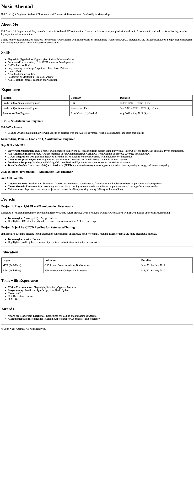

# Resume — HTML Only (No CSS)

Single-page resume website built using **only semantic HTML** (no CSS), matching the provided layout requirements.

## Live Demo

- GitHub Pages: https://imshaiknasir.github.io/resume/

## Setup / Run Locally

No dependencies required.

Open directly:
- Open `index.html` in any browser.

Then open:
- http://localhost:8000

## Usage

- Edit content in `index.html` (sections are already structured with headings, lists, and tables).

## Demo Screenshots

- Desktop preview:

